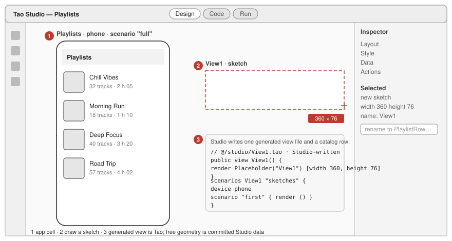
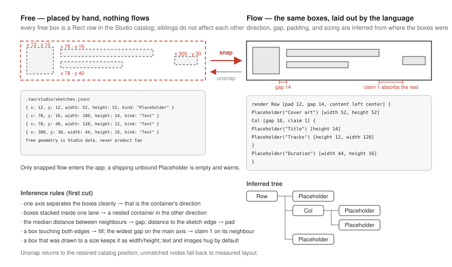
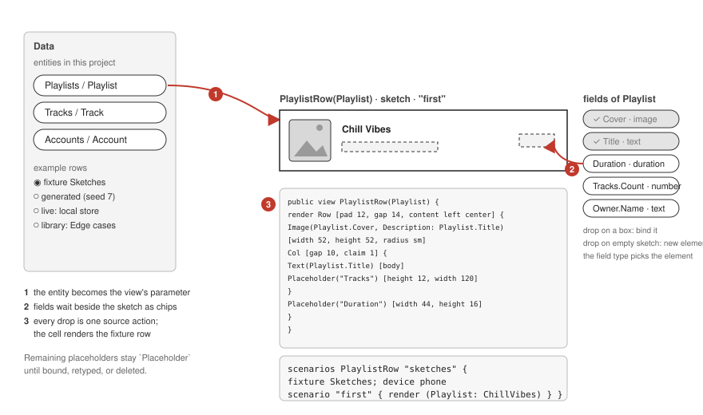
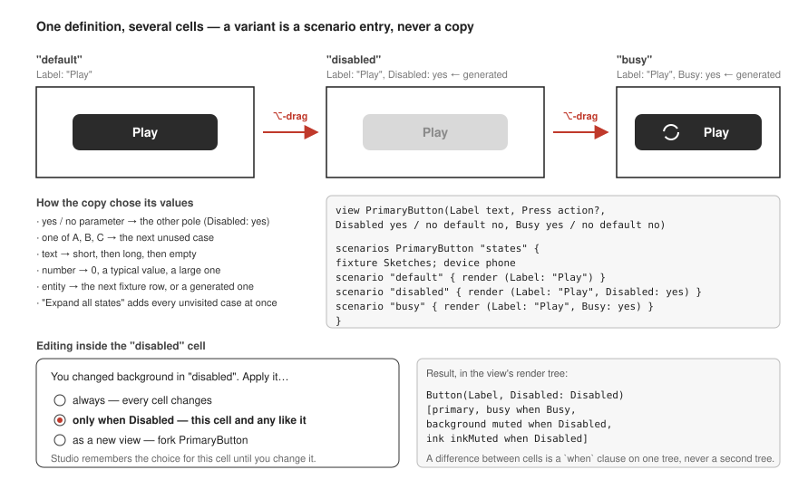
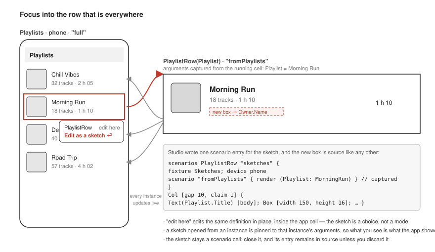
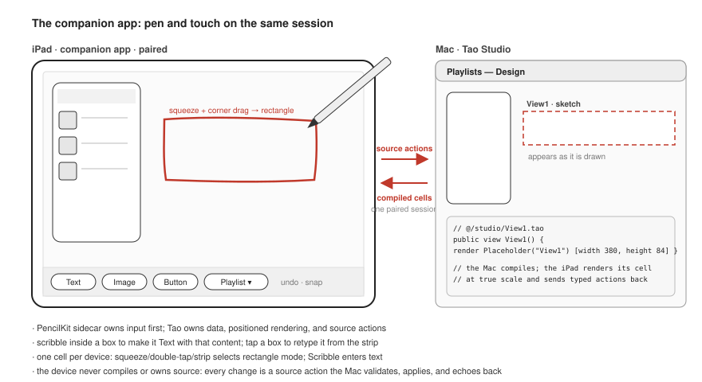
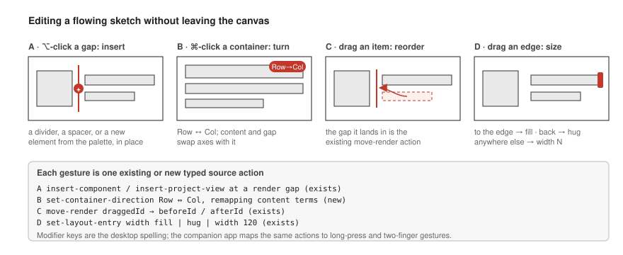

# Product - Freehand UI sketching

Status: authoritative product and design record for freehand UI sketching in Tao Studio. Product
discovery closed 2026-09-02 (FS-D1–FS-D20, the Developer); the two L1 spellings FS-D7 and FS-D10 left open were
settled by the Developer on 2026-09-03 and are recorded below. It describes a Tao Studio capability from the
perspectives that matter for designing and then implementing it: the person arriving from Figma, the
language, Studio's architecture, example data, the companion app, and the developer working beside
the designer. It carries user stories, wireframes, alternative ways to meet each need, and the
alternatives that informed the settled design. The "Design record" section below is authoritative for
this project; `Docs/Spec/` changes only as implementation lands. Language spellings it leaves open are
settled through `Apps/WordFlower/2 - Next` before their tranche begins. Tao snippets use the decided
dialect (`Col [card]`), not the executable tranche's `Col() [card]`.

Wireframes live in `wireframes/` beside this file and are embedded where the stories use them.

This document says _sketch_ for what Figma calls a frame. The word `frame` is taken: it is the
interaction system's shell nav kind (KEY-D7) and a retired view kind, and a document about drawing
should not reuse it.

## Design record

A designer draws a sketch beside the running app, lays out free rectangles as Studio-owned data,
then snaps some or all of them into the Tao view's flowed render tree. Studio creates the public,
read-only generated view immediately under `@/studio`, persists free geometry in the project's
committed Studio catalog, and uses typed source actions for every transition into or edit of Tao
source. Scenarios render real entities, deterministic generated fixtures, and journey-reached
states as variant cells. The Mac remains the source-owning compiler; a later companion renders one
cell and delegates initial Pencil input to a native sidecar.

### Authority and data boundary

- Unsnapped geometry, content hints, and bindings are Studio data in
  `.tao-project/studio/sketches.jsonc`; they are not Tao render nodes.
- Snapping is the only operation that writes those rectangles into a view's flowed Tao render tree.
  A partially snapped sketch is therefore a flowed source subtree plus remaining Studio rows, merged
  by Studio for editing. Later Snap and Unsnap operations patch only their selected Studio-owned
  leaves so manual edits and flow actions survive.
- Generated project source lives under the reserved root package `@/`, one generator per subfolder.
  Studio owns `@/studio/*.tao`; developers take ownership through Move to package.
- A snapped `Placeholder` is valid product source. Development makes it visibly labelled and
  hatched; release renders its empty dimensions and `tao check` warns.
- The Studio server owns file and catalog persistence. Browser and companion clients use the paired,
  versioned session and never write project files directly.

### Scenario and variant boundary

- Scenario entries may omit a fixture when no fixture handle is referenced. Required action
  parameters omitted by a focused render receive logging stand-ins.
- A scenario entry may contain ordered test-shaped steps after its subject. Existing plain press,
  enter, submit, and tagged-row select steps remain available; pointer phase, hover, and focus extend
  that seam. States are reached by replay, never forced.
- Duplicate cells are scenario entries over one definition. Generated values are deterministic and
  become durable only when promoted to ordinary fixture rows.
- Editing a variant cell is an explicit persistent mode. Conditional changes default to the cell's
  non-default arguments and write their conjunction as a postfix `when` condition.

### Layout and device boundary

- Snap begins with deterministic projection inference and asks through the existing proposal
  endpoint when projection is ambiguous, including overlap or two clean separating axes. Unsnap
  prefers the remembered rectangle position, dropping stale render matches and falling back to
  measured layout.
- Free rectangle rendering begins as a TypeScript matrix overlay. A later positioned-container
  tranche moves it into Studio's own Tao client after the `Canvas` and offset spellings are settled.
- The companion waits for Tao rendering and an app shell. One device renders one cell. PencilKit
  initially owns canvas input and emits typed events; Tao owns data, rendering, and source actions.

### What is derived, never declared

- `View1`, `View2`, … comes from a project-wide monotonic allocator; deleted numbers are not reused.
- Snap direction, nesting, gap, pad, fill, claim, fixed dimensions, and hug behavior are inferred
  from geometry by the FS-D11 projection rules.
- Generated snapped leaves carry a private source marker so a catalog rectangle can recover the
  compiler manifest identity after recompilation. Only Studio-owned `@/studio` source publishes that
  identity, and Move to package removes the marker.
- A focused instance's entity and handle come from the interaction outline's item provenance. No
  second binding graph is declared.
- Generated example values come from a stable seed plus field name and type vocabulary.
- A variant edit's initial `when` condition is the conjunction of its non-default arguments.

### Boundaries

- Tao source owns declarations and every flowed element; Studio's catalog owns only free geometry.
- `@/` is committed generated source, not a scratch cache. Fixers check it but do not rewrite it.
- Source actions keep the existing project, app, preview, source-version, revision-bound range,
  render-owner, node-kind, and cell/scenario trust boundary.
- The positioned container is a language capability forced by Studio, but still follows the normal
  WordFlower tranche and absorption process.
- Runtime interaction states remain runtime-owned, modality-neutral, unsettable, and unrestored per
  KEY-D8. Scenario steps produce them through ordinary events.
- The native sidecar never owns Tao source or durable sketch state.

### Deferred

- Scenario world controls for text scale, loading, and empty.
- Model-generated example suggestions; they later use the same fixture-promotion path.
- Fixture-through-action semantics for explicit real action parameters.
- Focus-in until interaction-outline item provenance lands.
- The companion until its app shell exists, Tao rectangle rendering has landed, and the required
  physical-device proof can run.
- Shrinking the native sidecar toward ink-only as Tao gesture primitives land.
- Photographing a paper sketch and having an agent add matching, editable Studio rectangles is a
  post-MVP input path. It reuses Draw and Snap; the photo import does not make flow or data-binding
  decisions. See the post-MVP target in `Plan - Freehand UI sketching.md`.

### L1 tranche decisions

- Scenario pointer phases are `press down <selector>` and `press up <selector>`; hover is
  `hover <selector>`. All three accept the existing text, label, placeholder, and `#tag` selector
  family. Focus is tag-only as `focus #tag`. Plain `press`, `enter`, `submit`, and tagged-row
  `select` retain their test-step spellings in scenario prefixes.
- `Spacer()` is the semantic flexible-space leaf. It has implicit `claim 1`, and an explicit
  `[claim N]` overrides that weight.

### Decisions

The following rulings are recorded verbatim from the project requirement authority.

> **FS-D1 — Unsnapped rectangles are Studio data, never Tao code.** They are rows in Studio's own
> catalog (`Sketch` with `Name`, `Project`, `View`, `Width`, `Height`, owned ordered `Rects`;
> `Rect` with `X`, `Y`, `Width`, `Height`, `Kind`, `Content?`, `Binding?`), rendered by Studio's
> own Tao client positioned absolutely on the canvas. A sketched view's render tree is written only
> by snapping and holds only flowed elements. The product draft's `Sketch` container, `at` clause
> in product source, and nested sketches are withdrawn.

> **FS-D2 — Nothing gates release.** An app contains only views, so no sketch-tier diagnostic
> exists. A snapped but unbound placeholder ships as an empty box of its size, and `tao check`
> warns that a `Placeholder` is shipping.

> **FS-D3 — The root `@` package holds generated code.** Every Tao project has a committed `@/`
> folder at its root, meant only for generated source, one subfolder per generator. Studio writes
> one file per view at `@/studio/<Name>.tao`, imported as `use <Name> from @/studio`; the view is
> `public`; it reaches the project's declarations through ordinary relative imports
> (`use Playlist from ../../Data`). Studio writes the file with mode `0444`, flips the owner bit
> to write and back, and re-asserts `0444` on every `@/studio/*.tao` when it opens a project,
> because Git does not track the write bit. Never use the macOS immutable flag; Git cannot replace
> an immutable file. The fix lanes (`tao fix`, `dprint fmt`) are check-only under `@/`. A header
> comment says the file is Studio-written and read-only until moved. `tao create` scaffolds an
> empty `@/`. A "Move to package" action moves the file with history, rewrites every
> `use … from @/studio` site, and asks only when the target package already declares the name.

> **FS-D4 — Sketch data persists in `.tao-project/studio/sketches.jsonc`**, written by the Studio
> server's provider and committed by default. The companion app reads it through the paired session,
> never the file.

> **FS-D5 — Rendering the rectangles.** The language direction is a positioned container, working
> name `Canvas`, whose direct children carry an offset clause, working name `at x y`, with Studio's
> own Tao client as the forcing feature. It is decided through the tranche process; its spelling is
> settled with the Developer in `2 - Next` before that tranche starts. Until it lands, Studio draws rectangles
> as a TypeScript overlay in the matrix view. Tao rendering must land before the companion slice.

> **FS-D6 — What travels with a view.** Declarations that relate only to the view, its `scenarios`
> group above all, live in the view's file. Shared declarations, the example fixture `Sketches`
> above all, live in `@/studio/Sketches.tao`. Move to package offers to relocate the group into the
> app's `Scenarios.tao`, defaulting to yes.

> **FS-D7 — States are reached by steps, never forced.** A scenario entry accepts ordered steps
> after its subject, spelled exactly as in a test body, so an entry is a journey prefix that ends
> in a state. The step seam gains phase and pointer steps, proposed as `press down "…"`,
> `press up "…"`, `hover "…"`, and `focus #tag`, each lowering to the testing library's own events;
> a held press with `advance 600.ms` is the long press. There is no `while pressed` world control.
> Studio replays an entry's steps when its cell mounts and the cell stays interactive afterwards.

> **FS-D8 — A required `action` parameter may be omitted in a scenario `render`.** The harness
> binds a stand-in that records each invocation in the cell's log. No spelling. When
> fixture-through-action semantics are adopted, an explicit real action becomes the upgrade.

> **FS-D9 — A fixture is optional in a scenario entry.** Absence means an empty store. The
> validator requires one when the entry's arguments or `prepare` block reference handles.

> **FS-D10 — `Placeholder` is a stdlib element.** `Placeholder("Cover art") [width 52, height 52]`
> renders as a labelled hatched box in development and an empty box of its size in release. It may
> carry a binding hint, act as a drop target for field chips in a running cell, show as unbound in
> the inspector, and count in the design check. A `Spacer` element is the leaning for the spacer
> role; its spelling versus `Box [claim 1]` is settled in `2 - Next`.

> **FS-D11 — Snap.** Implement basic projection inference first (one clean separating axis is
> the container direction; stacked boxes in one lane nest in the other direction; the median
> neighbour distance is `gap`; the distance to the sketch edge is `pad`; a box touching both
> edges is `fill`; the widest slack puts `claim 1` on its neighbour; drawn sizes stay `width` and
> `height`; text and images hug). When projections overlap, show the proposed tree as an overlay
> through the existing proposal endpoint before applying. Beside inference: dragging one unsnapped
> rectangle over a view shows where it would land using the gap indicators palette drops already
> use, and spacers split a row, with dragging a spacer in edit mode rewriting the neighbours'
> `claim` weights through the existing layout action. Evidence that closes the inference: over a
> corpus of fifteen to twenty real screens flattened to rectangles, at least four in five snap
> without the overlay and no snapped tree needs more than two inspector fixes.

> **FS-D12 — Unsnap.** A rectangle row keeps its canvas position after snapping and unsnapping
> returns the element there. Rows match view nodes by the manifest's render identity while Studio
> runs; a row whose node was deleted, retyped, or cannot be matched on reopen is dropped, and
> unsnap then falls back to measured layout.

> **FS-D13 — Naming.** New views are `View1`, `View2`, … numbered project-wide and never reused,
> with the file `@/studio/View1.tao` created the moment the view is created on the canvas. A Tao
> identifier cannot hold a space; spaced names are not adopted. Until the first snap the view's
> render tree is one `Placeholder` the size of the sketch.

> **FS-D14 — Duplicate is Option-drag** on the Mac and long-press then Duplicate on the
> companion.

> **FS-D15 — Focus-in takes an instance's arguments from the interaction outline's item
> provenance** (entity plus handle per loop item, KEY-D). Focus-in is sequenced after that
> provenance lands with the keyboard tranches; editing in place inside the app cell covers the
> need meanwhile. A live-store row is captured into the fixture before the entry references it.

> **FS-D16 — Generated example values are deterministic** from a seed, with a vocabulary keyed by
> field name and type (titles, people, addresses, placeholder images; text in short, long, and
> empty forms; numbers as zero, typical, and large). A generated value reaches source only when the
> cell is kept, and then as an ordinary fixture row. Model-generated suggestions come later and
> promote the same way.

> **FS-D17 — Editing inside a variant cell is a persistent mode**, shown on the cell as
> "Editing: this state" or "Editing: all states", defaulting to the state when the cell has
> non-default arguments. The written condition is the conjunction of the cell's non-default
> arguments (`when Disabled and Busy`), and the inspector lets the designer drop a term. No
> per-edit prompt.

> **FS-D18 — The companion canvas.** A device shows one cell at a time, stepping through a group,
> until every runtime store a cell uses is instance-scoped. A native sidecar (PencilKit through an
> Expo module, declared as a foreign view with `accepts content slots`) owns all canvas input at
> first — ink, selection, move, resize — and emits typed events (`Drew action(RectShape)`,
> `Wrote action(text, Rect)`, `Moved action(Rect, RectShape)`); Tao owns the data, the rectangle
> rendering through the positioned container, and every source action to the paired Mac. The
> sidecar shrinks toward ink-only as Tao gesture primitives land from the drag-and-drop example app.

> **FS-D19 — Rectangle creation is a pencil mode, not recognition.** Hold the pencil's side
> gesture, put the tip down at one corner, drag to the opposite corner, lift or release to commit.
> Apple Pencil Pro's squeeze reports began, changed, and ended phases; Apple Pencil 2's double-tap
> toggles the rectangle tool; the strip carries a rectangle tool for fingers and other styluses.
> Text is Apple Scribble. No free-ink shape recognition.

> **FS-D20 — Order.** The scenario and stdlib tranche (L1) first, then Studio slices 1 (Draw)
> and 2 (Snap) together, then 3 (Feed), then the executable-dialect tranche (L2) and slice 4
> (Variants), then the positioned container (L3) and slice 5 (Tao-rendered canvas), slice 6
> (Focus-in) when the interaction outline's provenance has landed, slice 7 (Companion) after the
> companion app shell exists. If budget runs out, later slices are dropped, never interleaved
> half done.

### Withdrawn

- The `Sketch` container and `at` in product source.
- A release rule on sketch content or any other sketch-tier diagnostic.
- `Sketches.tao` at the app root.
- `while pressed` and all forced interaction-state world controls.
- A root-absolute import form distinct from the root `@` package.
- Spaced Tao identifiers.
- Free-ink shape recognition.

The alternatives that were weighed for each of these choices, and for the choices above, are
preserved as history in "Ways to meet each need" below, labelled withdrawn and pointing to the
corresponding FS-D decision.

## The intention

Studio already lets a person drag components from a palette into a running app and edit layout and
style through the inspector. This document is about the other way in: drawing. A person who thinks
in Figma should be able to draw a rectangle on the canvas next to the running app, put boxes inside
it where they want them, decide later how those boxes flow, turn boxes into text and images and
buttons, feed the sketch with real data by dragging an entity into it, and end up not with a picture
of a component but with the component — a Tao `view` that already runs in the app, with its states
laid out as cells beside each other. The same person should be able to focus into a button or a row
that appears in twenty places and edit the one definition as a sketch. And they should be able to do
a good part of this on an iPad with a pencil, or on the phone at true size, with the Mac keeping up.

## Why it can be better here than anywhere else

- **Flow is source; free geometry is Studio data.** Unsnapped rectangles live in the committed
  `.tao-project/studio/sketches.jsonc` catalog. Snapping writes flowed elements into the generated
  view, and every source mutation remains versioned and undoable. The companion sees both through
  the paired Studio session (FS-D1, FS-D4).
- **The vocabulary is already Figma's.** Fill container, hug contents, and fixed are `fill`, `hug`,
  and `width N`. Auto layout is `Row` and `Col` with `gap`, `pad`, and `content`. Figma's free
  placement maps to Studio catalog rectangles until Snap turns them into that layout vocabulary. A
  designer's muscle memory maps onto the flow language almost word for word
  (`Docs/Spec/Tao Layout and UI.md`).
- **Data is real, and example data is shared.** A sketch is fed with an entity, not with a content
  plugin's strings. Its example rows are `fixture` rows — the same rows the tests and the scenario
  gallery use — so a screenshot, a journey, and the designer's sketch cannot drift apart.
- **Variants are one definition.** Figma's copy-and-edit habit produces divergent copies that a
  human keeps in sync. Here a variant is a `scenarios` entry over one `view`, and a difference between
  cells is a `when` clause on one render tree, never a second tree.
- **The preview is the product.** A cell renders the real React Native app, at true size on a
  paired phone. There is no handoff: the Code preset shows the source the whole time, and a developer
  can keep typing in it while the designer draws.
- **States that only a running app has are one pin away.** Dark, offline, right-to-left, another
  locale: the scenario surface already pins them, so a sketch's cells can show them without a designer
  faking them with grey boxes. Loading, empty, and large text need world controls that have not landed
  and are listed under what is missing.

## Vocabulary: Figma to Tao Studio

| Figma                                    | Tao Studio                                                                |
| ---------------------------------------- | ------------------------------------------------------------------------- |
| Frame                                    | a sketch: one `view` plus one `scenarios` entry rendered as a cell        |
| Auto layout                              | `Row`, `Col`, `WrappingRow`, `Grid`                                       |
| Fill container / Hug contents / Fixed    | `fill` / `hug` / `width N`, `height N`                                    |
| Absolute position while sketching        | a `Rect` row in Studio's sketch catalog; not product source (FS-D1)       |
| Padding, gap, alignment                  | `pad`, `gap`, `content`                                                   |
| Component                                | a `view` declaration                                                      |
| Instance                                 | a render site of that view                                                |
| Text property                            | a `text` parameter                                                        |
| Boolean property                         | a `yes / no` parameter                                                    |
| Variant property                         | a `one of` case parameter                                                 |
| Instance-swap property                   | a named slot `@name`, or caller content `@@content`                       |
| Component set (variants)                 | a `scenarios` group; each variant is an entry with arguments              |
| Interactive states (hover, pressed)      | `hovered`, `pressed`, `focused` conditions in a clause list               |
| Variables and modes (light, dark)        | design tokens and `when Scheme is Dark`                                   |
| Styles                                   | design bundles and element defaults in `design { }`                       |
| Content Reel, Sheets sync, Sketch's Data | fixture rows, generated example values, the live store, a fixture library |
| Option-drag to duplicate                 | duplicate the cell as a new scenario entry with generated arguments       |
| Prototype link                           | `present` / `open` at a call site                                         |
| Dev Mode, handoff                        | none — the sketch is the code                                             |

## Perspective: the designer — user stories

Each story names the intention first, then the steps the person takes in the imagined finished
Studio, then what Tao wrote, then what is different from doing the same thing in Figma. The
designer in these stories is Noor, who has used Figma daily for years and Tao for an hour. The
project is a small music app with `Playlists / Playlist` and `Tracks / Track` entities.

### Story 1 — A playlist row, fed by an entity

**Intention.** Noor wants a row for the playlist list: cover art on the left, title and a tracks
line, duration on the right. They want to draw it first and worry about layout after, and they want
to see it with real playlists, not lorem ipsum.

**Steps.**

1. Noor opens the project in Studio's Design preset. The app runs in a cell, in its `"full"`
   scenario, exactly as it does today (wireframe 1, callout 1).
2. They drag on the empty canvas beside the phone. A 360 by 76 sketch appears with a size badge, a
   tab reading `View1 · sketch`, and a rename field in the inspector. Noor types `PlaylistRow`.
3. Inside the sketch they draw four boxes: a square at the left, two lines beside it, a small box at
   the right. Each lands exactly where drawn; nothing reflows (wireframe 2, left).
4. From the Data panel they drag `Playlists / Playlist` onto the sketch. The tab now reads
   `PlaylistRow(Playlist)`, a column of field chips appears beside the sketch — `Cover`, `Title`,
   `Duration`, `Tracks.Count`, `Owner.Name` — and the sketch's cell is now rendering the fixture row
   `Chill Vibes`, although nothing inside is bound yet (wireframe 3, callouts 1 and 2).
5. They drop `Cover` on the square: it becomes an `Image` showing the cover. `Title` on the first
   line: a `Text` reading "Chill Vibes". `Tracks.Count` on the second line: Studio proposes
   `"{ Playlist.Tracks.Count } tracks"` and Noor accepts. `Duration` on the small box at the right.
6. They press Snap (⇧A, as in Figma). Studio infers a `Row` holding the image, a `Col` with the two
   texts, and the duration, with `gap 14`, `pad 12`, and `claim 1` on the column so the title takes
   the slack (wireframe 2, right). The rendering does not visibly change; the source did.
7. Option-drag on the sketch makes a second cell beside it with the next fixture row, `Morning Run`.
   A third Option-drag, with the "generated" example source selected, renders a playlist with a very
   long title. Noor sees the title wrap, opens the inspector, and sets `Lines: 1`; all three cells
   update.
8. From the Views palette they drag `PlaylistRow` into the phone cell, onto the list. Studio sees the
   drop landed inside `loop Playlists / Playlist`, binds the parameter from scope, and the app's
   list now renders Noor's row.







**What Tao wrote.**

```tao
// @/studio/PlaylistRow.tao — Studio-written, read-only until moved
use Playlist from ../../Data

public view PlaylistRow(Playlist) {
   render Row [pad 12, gap 14, content left center] {
      Image(Playlist.Cover, Description: Playlist.Title) [width 52, height 52, radius sm]
      Col [gap 10, claim 1] {
         Text(Playlist.Title, Lines: 1) [body]
         Text("{ Playlist.Tracks.Count } tracks") [caption]
      }
      Text(Playlist.Duration.Clock) [caption]
   }
}

scenarios PlaylistRow "sketches" {
   fixture Sketches
   device phone

   scenario "first" { render (Playlist: ChillVibes) }
   scenario "second" { render (Playlist: MorningRun) }
   scenario "longTitle" {
      prepare { update ChillVibes { Title: "Songs for the drive up the coast and back again" } }
      render (Playlist: ChillVibes)
   }
}

// @/studio/Sketches.tao holds the shared fixture named above.
```

and, in the app's list, `loop Playlists / Playlist { PlaylistRow(Playlist) }`.

**What is different.** From step 4 the sketch has a typed parameter, so there was never a moment
where the row was a picture of a row. The long-title variant is a `prepare` delta over a fixture
row, which a test can reuse. Step 8 is the whole handoff.

### Story 2 — A button with states

**Intention.** Noor wants a primary button used everywhere, and they want to see it normal,
disabled, busy, and dark, side by side — the way they would build a component set in Figma — without
maintaining four copies.

**Steps.**

1. A new 240 by 100 sketch. Noor draws a rounded box, double-clicks it, and types `Play`. They press
   B, and the box becomes a `Button` — the stdlib button, rendered by the design's element default.
2. They select the literal `Play` and choose Make parameter. Studio adds `Label text` to the view's
   head and `Label: "Play"` to the cell's scenario entry.
3. In the inspector's Parameters context they add `Disabled`, kind yes / no, default no. Studio
   wires it to the button's own `Disabled` slot.
4. Option-drag on the sketch. The copy's arguments are generated: the only unvisited value is
   `Disabled: yes`, so the new cell is the disabled button, drawn by the stdlib control's own disabled
   look (wireframe 4).
5. In the disabled cell Noor changes the background to `muted` from the Style context. Studio asks
   whether the change applies always, only when Disabled, or as a new view. They choose only when
   Disabled, and the clause lands as `background muted when Disabled`.
6. They add `Busy` the same way and choose Expand all states; two more cells appear, `busy` and
   `disabled + busy`.
7. They pin `appearance dark` on the group's cells; every button re-renders dark through the design's
   `Scheme` conditions, with nothing drawn twice.
8. They duplicate a cell and append `press down "Play"`, `advance 600.ms`, and
   `press up "Play"` after its render subject. Studio replays the journey prefix on mount, leaving
   the cell interactive in the reached state (FS-D7; the exact phase spellings are now settled).



**What Tao wrote.**

```tao
view PrimaryButton(Label text, Press action?, Disabled yes / no default no, Busy yes / no default no) {
   render Button(Label, Disabled: Disabled)
      [primary, busy when Busy, background muted when Disabled, ink inkMuted when Disabled, background accent.60 when pressed] {
      on press Press
   }
}

scenarios PrimaryButton "states" {
   device phone

   scenario "default" { render (Label: "Play") }
   scenario "disabled" { render (Label: "Play", Disabled: yes) }
   scenario "busy" { render (Label: "Play", Busy: yes) }
   scenario "disabledBusy" { render (Label: "Play", Disabled: yes, Busy: yes) }
   scenario "held" {
      render (Label: "Play")
      press down "Play"
      advance 600.ms
      press up "Play"
   }
}
```

**What is different.** The cells are argument sets and journey prefixes over one tree. Editing mode
persists as “this state” or “all states”; the state mode writes the conjunction of non-default
arguments and the inspector can remove a term. A required action parameter may be omitted because
the scenario harness supplies a stand-in that logs invocations. A fixture is absent when the entry
uses no handles (FS-D7–FS-D9, FS-D17).

### Story 3 — Focus into the row that is everywhere

**Intention.** In the running app Noor notices the row should show the owner's name under the
title. The row appears on three screens. They want to edit it once, in place, while seeing the row
the app is actually showing.

**Steps.**

1. In the phone cell they click the second row. The selection outline names it `PlaylistRow`, with
   two choices: edit here, or Edit as a sketch (wireframe 5).
2. Edit as a sketch opens a sketch beside the phone, pinned to that instance's arguments: the row is
   `Morning Run`, exactly as the app showed it. If the row had come from the live store rather than
   a fixture, Studio captures it into the fixture first, through the existing capture flow.
3. Under the title they draw a free rectangle over the flowing column. Studio keeps it as a catalog
   row and shows the same gap indicator palette drops use; dropping it into the gap snaps just that
   rectangle into the view's flow (FS-D1, FS-D11).
4. They drop `Owner.Name` on it. All three rows in the phone update at once, and so does every other
   screen the row is on.
5. They close the sketch. Its scenario entry remains in source as `"fromPlaylists"` unless they choose
   Discard sketch, which removes the entry and leaves the view.



**What is different.** Figma's "go to main component" leaves the instance behind; here the sketch is
the definition rendered with the instance's data, so the designer never loses the context that made
them want the change. "Edit here" is the same edit without opening a sketch: selection inside an
occurrence already edits the owning view's tree.

### Story 4 — A whole screen, sketched loose and snapped

**Intention.** Noor wants a Now Playing screen and has no layout in mind yet: big artwork, title,
artist, a progress line, three round buttons. They want to draw the whole thing loosely, then decide
what stacks and what sits side by side.

**Steps.**

1. They draw a sketch and pick the phone preset from its size badge; the sketch becomes 390 by 844 and
   its scenario is on `device phone`.
2. They draw the artwork box, two text lines, a thin line, and three circles, all free.
3. They drag `Tracks / Track` onto the sketch and bind artwork, title, and artist. The circles they
   retype to `Button`, picking an icon each from the inspector.
4. They select the three circles and press Snap; only those become a `Row [content center center,
   gap lg]`, and the rest stays free. Then they select everything and press Snap; Studio proposes a
   `Col` with the row inside it, shows the proposed tree over the sketch, and Noor accepts
   (wireframe 2 describes the rules; wireframe 7 the gestures that follow).
5. They ⌘-click the button row to try it vertical, dislike it, and press undo.
6. They ⌥-click the gap between the artwork and the title and insert a divider from the palette.
7. From the Views palette they drag `NowPlaying` onto a row in the phone cell's playlist list; Studio
   offers `on select -> { present NowPlaying(Track) as sheet }`, with the mode chosen in the prompt,
   and Noor accepts. The press behavior of the three
   buttons is left for whoever wires actions, with a `Press action` stand-in in the cell meanwhile.

**What is different.** Partial snapping merges two authorities in Studio: flowed nodes from the Tao
view and free rectangles from the committed sketch catalog. Product source contains only views.
Unsnapped rectangles therefore cannot leak into the app, while a snapped unbound `Placeholder`
ships as an empty box and produces a `tao check` warning (FS-D1, FS-D2).

### Story 5 — Sketching on the iPad with a pencil, the Mac keeping up

**Intention.** Noor is on the couch with an iPad and a pencil; Studio is running on the Mac across
the room. They want to sketch the row at the size it will really be, with their hands, and have the
Mac and the source follow.

**Steps.**

1. They open the Tao Studio companion app on the iPad, scan the QR code Studio shows, confirm the
   pairing code on both screens, and pick the project. The iPad shows one cell at a time at its own
   scale, with room around it to draw; the Mac's grid stays the overview (wireframe 6).
2. They enter rectangle mode: Pencil Pro squeeze reports began/changed/ended phases; Pencil 2
   double-tap toggles the tool; fingers and other styluses use the strip. They put the tip at one
   corner, drag to the opposite corner, and lift or release to commit the rectangle (FS-D19).
3. Inside it they draw a box and write "Chill Vibes" into it with the pencil; the box becomes a
   `Text` with that content. They draw a square and tap it, and pick Image from the strip.
4. They drag `Playlist` from the strip's entity menu onto the sketch with a finger, then drag chips
   into boxes with the pencil, as on the Mac.
5. A two-finger tap undoes the last action. Snap is a button on the strip.
6. They pick up the iPhone, which is paired to the same session and shows one cell at a time. They
   choose the `PlaylistRow` cell and see the row at thumb size; the height is wrong, so they drag the
   sketch's bottom edge with a finger. The Mac's source updates to the new height; the developer at
   the Mac sees the diff in the Code preset and keeps typing.



**What is different.** The device never compiles, owns source, or reads the catalog file. A native
PencilKit sidecar initially owns canvas input and emits typed rectangle/text/move events. Tao owns
the data, positioned rendering, and paired source actions; the Mac validates, applies, compiles, and
echoes them. One device shows one cell at a time until every store is instance-scoped (FS-D18,
FS-D19).

## Perspective: the language — what the canvas writes

The canvas writes Tao only when an operation produces flowed product behavior. Free geometry stays
in Studio's catalog. This section separates those authorities and lists the language work required
for scenarios, placeholders, variants, and Studio's eventual Tao-rendered overlay.

### A sketch is a generated view, a scenario, and Studio data

Studio creates `@/studio/View1.tao` the moment the designer draws the outer rectangle. The file holds
a public view and its view-specific `scenarios` group. Before the first snap its render tree is one
`Placeholder` matching the sketch size. Shared example rows live in `@/studio/Sketches.tao`.

Free geometry is separate. Studio's server persists it in
`.tao-project/studio/sketches.jsonc`, committed by default:

```jsonc
{
  "sketches": [
    {
      "name": "View1",
      "project": "music",
      "view": "View1",
      "width": 360,
      "height": 76,
      "rects": [
        { "x": 12, "y": 12, "width": 52, "height": 52, "kind": "Placeholder", "content": "Cover art" },
        { "x": 78, "y": 16, "width": 180, "height": 14, "kind": "Text" },
      ],
    },
  ],
}
```

The matrix initially renders those rows as a TypeScript overlay. Snapping writes only the projected
flowed elements into the view and removes the corresponding free rows. A later language tranche
settles a positioned container, working name `Canvas`, and child offset, working name `at x y`, so
Studio's own Tao client can render the same catalog. Those constructs render Studio data; they do not
put free placement into product source (FS-D1, FS-D4, FS-D5).

### Placeholders and spacers

`Placeholder("Cover art") [width 52, height 52]` is a stdlib element. Development renders a labelled
hatched box; release renders an empty box with the same dimensions and `tao check` warns. It can
carry a binding hint, receive a field-chip drop, appear as unbound in the inspector, and participate
in the design check. Flexible intentional space is the semantic `Spacer()` leaf, with implicit
`claim 1` and an explicit `[claim N]` override (FS-D2, FS-D10 and the settled L1 decision).

### Parameters from data and from literals

- Dropping an entity on a sketch adds a bare-name parameter to the view head (`view PlaylistRow(Playlist)`)
  and an argument to every entry of the sketch's group, chosen from the selected example source.
- Dropping a field chip binds a placeholder by the field's type: `image` to `Image`, `text` and
  numbers to `Text`, a `yes / no` field to a condition or an icon, a to-one relation to nested chips one
  level deep (`Owner.Name`), and a collection to a `loop` with a flowed row view.
- Make parameter extracts a literal into a typed parameter and adds the argument to every entry of
  the group; the reverse, inlining a parameter, is the same action backwards.
- Adding a parameter by hand in the inspector offers the kinds the scenario surface can argue:
  text, number, yes / no, `one of` cases, an entity, and an action. An omitted required action gets
  a per-cell logging stand-in (FS-D8).

### Variants are scenario entries; states are conditions

Duplicating a cell writes a new entry. Generated arguments follow the parameter's type: the other
pole of a `yes / no`, the next unused case of a `one of`, the next of short, long, and empty for
text, `0`, a typical value, and a large one for numbers, the next fixture row for an entity.
Expand all states writes one entry per unvisited case, and a full cross on request. A text variant of
an entity field is a `prepare { update Handle { … } }` delta, never a mutated fixture.

A cell carries a persistent mode: `Editing: this state` or `Editing: all states`. A non-default cell
defaults to this state. The conditional mode writes the conjunction of the cell's non-default
arguments (`when Disabled and Busy`), and the inspector can remove a term. Interaction states are
reached by ordered scenario steps after `render`, never forced or restored; the cell remains
interactive after replay (FS-D7, FS-D17).

### What would be new in the language

- Scenario-entry journey steps, omitted-action stand-ins, fixture-less scenarios, and the
  `Placeholder`/spacer stdlib surface (L1).
- Postfix `when` over a parameter (`background muted when Disabled`) and over interaction states,
  which are decided but not executable: the parser admits only `when Scheme is Light` or `Dark`.
- `yes / no` as a parameter type, with `yes` and `no` literals, in the executable dialect.
- The positioned container and offset used by Studio's own client (L3), after their spellings and
  relationship to KEY-D7's floating layers are settled in `2 - Next`.

There is no sketch-tier syntax, release diagnostic, `while pressed`, or action-stand-in spelling.

## Perspective: Studio — canvas, identity, actions, inference

### The canvas

The existing scenario canvas renders grouped rows of cells. A sketch is a generated view and
scenario cell plus its free catalog rows, so it lives on the same canvas next to the app. Cells keep
their iframe realm. Until Slice 5, the matrix's TypeScript layer renders free rectangles, selection,
insertion lines, size badges, and field chips above the preview. Flowed elements remain preview
nodes. After L3, Studio's Tao client renders the catalog through the positioned container (FS-D5).

### Identity and trust

Every gesture becomes a source action carrying the identity the protocol already binds: project,
app, preview instance, source version, revision-bound range, node kind, owning view, and for a cell
the exact cell revisions and scenario. The server resolves ranges in current source and rejects
stale identity with structured conflicts; proposal and apply share one preparation path, and undo is bound to the
latest checkpoint. None of that changes. A sketch opened from a running instance takes its entity and
handle from the interaction outline's item provenance after that keyboard tranche lands (FS-D15).

### Source actions this needs

| Action                         | Status | Notes                                                                                        |
| ------------------------------ | ------ | -------------------------------------------------------------------------------------------- |
| `insert-component` at a gap    | exists | palette drops; wireframe 7 A                                                                 |
| `insert-project-view` at a gap | exists | zero-argument today; needs binding from scope for parameterized views                        |
| `move-render`                  | exists | wireframe 7 C                                                                                |
| `set-layout-entry`             | exists | wireframe 7 D; the sizing handles write `fill`, `hug`, `width N`                             |
| `set-style-entry`              | exists | the conditional variant adds `when <argument>` (see `set-conditional-style`)                 |
| `wrap-render`                  | exists | `Stack` only; snapping needs `Row` and `Col` with clauses                                    |
| `set-scenario-arguments`       | exists | rewrites one existing focused-render entry; creating entries belongs to `duplicate-scenario` |
| `insert-captured-fixture`      | exists | focus-in from a live row; example rows promoted to source                                    |
| `create-sketch-view`           | new    | writes `@/studio/ViewN.tao`, its group and initial `Placeholder`, plus catalog row           |
| `set-sketch-rect`              | new    | writes position, size, kind, content, or binding in the catalog; never product source        |
| `snap-to-flow` / `unsnap`      | new    | atomically reconciles catalog rows and source; unsnap can use measured preview rects         |
| `retype-sketch-rect`           | new    | changes an unsnapped row's kind while it remains Studio data                                 |
| `add-parameter` / `bind-field` | new    | entity and literal parameters; chip drops                                                    |
| `set-conditional-style`        | new    | the always / when / fork prompt's result                                                     |
| `duplicate-scenario`           | new    | generated arguments; expand all states                                                       |
| `set-container-direction`      | new    | wireframe 7 B, remapping `content` terms across axes                                         |
| `insert-separator`             | new    | a divider or spacer at a gap                                                                 |

### Inference for snapping

The first cut is a projection algorithm, the one Figma uses for Add auto layout, with Tao's sizing
words as the output. Boxes whose projections on one axis do not overlap are siblings on that axis;
boxes stacked inside one lane become a nested container in the other direction; the median distance
between neighbours becomes `gap` and the distance to the sketch edge becomes `pad`; a box touching
both edges becomes `fill`; the widest slack on the main axis puts `claim 1` on the neighbour that
should absorb it; a box drawn to a size keeps `width` and `height`; text and images hug. When the
projections are ambiguous Studio shows the proposed tree as an overlay and asks, through the existing
proposal endpoint, before it applies. The rules are settled by FS-D11 and tuned against a committed
corpus of 15–20 real screens. At least four in five must snap without an overlay, and no accepted
tree may need more than two inspector fixes.

### Gestures in flow

Wireframe 7 maps the flow-editing gestures — insert at a gap, turn a container, reorder, resize to
fill or hug — to source actions. Modifier keys are the desktop spelling; the companion app maps the
same actions to long-press and two-finger gestures, consistent with the interaction system's rule
that long-press means target plus verbs.



## Perspective: data — where example values come from

A sketch with an entity parameter needs a row to render. Four sources, in the Data panel, selected per
sketch and remembered per cell:

1. **The fixture** — the project's named rows, shared with tests and the scenario gallery. Durable,
   reviewable, and the recommended default. The sketch's entry names the handle.
2. **Generated** — deterministic rows from a seed, derived from field names and types: `Title`
   yields titles, `Email` yields addresses, text takes short, long, and empty forms, numbers take
   zero, typical, and large. Transient until the designer keeps the cell, at which point the rows are
   written into the fixture through the existing capture action, so a saved sketch always names its
   example in source.
3. **The live store** — the rows the running app holds, through the existing runtime capture. Useful
   for focus-in (story 3) and for "what does this look like with my real data"; promoted to a fixture
   the same way when kept.
4. **A library** — a curated fixture of edge cases per entity (`fixture EdgeCases`), which is just a
   fixture file a project or a kit ships.

Two rules keep this honest. A cell's example is always nameable in source once the cell is saved, so
a sketch reloads identically on the Mac and on the companion. And generated values never overwrite a
fixture; a variant of a fixture row is a `prepare` delta on the entry.

## Perspective: the companion app — pen and touch

The Tao Studio companion app is decided (`../Tao ship/Plan - Beta distribution in one command.md`)
and its control plane is designed (`../Tao Studio v1/Exploration - Native device as Studio canvas.md`):
pairing by QR and confirmation code, one authenticated WebSocket carrying manifest revisions, cell
assignment and configuration, selection, and source-action requests with acknowledgements, and one
rendered cell per device. Freehand sketching adds a canvas and an input model on top of that plane;
it does not add a second editing protocol.

- **Two devices, two roles.** An iPad has room to draw beside a cell at the iPad's own scale, but it
  renders one cell at a time — a group stepped through — until every runtime store a cell uses is
  instance-scoped, which the native-canvas exploration makes a precondition for any on-device grid.
  An iPhone shows one cell at true size, which is the reason to sketch there at all: a row drawn on
  the phone is a row that fits a thumb. Both are views of the same session; the Mac's grid stays the
  overview.
- **Rectangle creation is a pencil mode, not recognition.** Pencil Pro squeeze supplies
  began/changed/ended phases; Pencil 2 double-tap toggles the mode; the strip exposes it to fingers
  and other styluses. Tip down at one corner, drag to the other, and lift or release to commit.
  Scribble supplies text. Free ink is never shape-recognized (FS-D19).
- **The device never owns source.** Ink is drawn locally and optimistically, and on pen-up the
  device sends one typed source action with the full identity tuple. The Mac validates, applies,
  compiles, and echoes the new cell; a stale identity is rejected and the device redraws from the
  echo. Concurrent edits from the Mac and a device resolve the way concurrent Studio edits already
  do, by source version.
- **True scale wins.** When a cell is assigned to a device, the device's measured viewport is the
  cell's viewport, reported through the designed `device.cellApplied` message; the sketch's `device` clause
  remains what the Mac's grid renders.
- **Where the canvas is implemented.** A native PencilKit sidecar, declared as a foreign view with
  `accepts content slots`, initially owns ink, selection, move, and resize and emits typed `Drew`,
  `Wrote`, and `Moved` events. Tao owns catalog data, L3 rendering, and paired source actions. The
  sidecar shrinks toward ink-only as Tao gesture primitives land (FS-D18).

## Perspective: the developer beside the designer

- **Readable output.** Every flowed source action is formatted as ordinary Tao; free geometry is
  stable, reviewable JSONC. Snap inference prefers the fewest clauses that reproduce the drawing,
  not the most precise.
- **Predictable homes.** Studio-generated public views and their view-only declarations live in
  read-only `@/studio/<Name>.tao`; shared examples live in `@/studio/Sketches.tao`. Move to package
  moves the file with history, rewrites imports, and offers to relocate its scenario group to the
  app's `Scenarios.tao` (FS-D3, FS-D6).
- **Only views ship.** Free rectangles stay outside the app in Studio's catalog. A snapped unbound
  `Placeholder` ships as an empty sized box and `tao check` warns, so release is never gated (FS-D2).
- **Tests fall out.** Every sketch has a scenario entry, optionally over a fixture, so the decided
  `tao review` will render it once that command exists, and a journey can mount the same view with
  the same handle once the runner executes fixtures and scenarios, which it does not yet. Coverage of the
  sketching features themselves is a Tao behavior test per language construct under
  `Apps/Test Apps/AGENTS.md`, and a Studio journey per gesture in `packages/ides/studio/studio-tests` and
  the smoke lanes `packages/ides/studio/README.md` describes.

## Ways to meet each need

| Need                               | Options                                                                                                                                  | Recommendation                                                                                     |
| ---------------------------------- | ---------------------------------------------------------------------------------------------------------------------------------------- | -------------------------------------------------------------------------------------------------- |
| Free placement                     | (a) Studio catalog rows; (b) `Sketch` + `at` product source; (c) general absolute layout; (d) `.tao-sketch`                              | **Settled: (a), FS-D1.** The later positioned container renders catalog data in Studio only.       |
| Where a new view is written        | (a) generated `@/studio/<Name>.tao`; (b) feature folder plus `Scenarios.tao`; (c) one app-root file; (d) ask                             | **Settled: (a), FS-D3/D6.** Move to package performs the deliberate transition to authored source. |
| Placeholder rendering              | (a) `Placeholder`; (b) Studio chrome over empty `Box`; (c) dev-only bundle                                                               | **Settled: (a), FS-D10.** Development hatches; release keeps only the empty size and warns.        |
| Example rows                       | (a) fixture only; (b) fixture, generated, live, library, all promoted to fixture on save; (c) Studio-owned example store                 | (b); (c) is the `example` declaration Studio already rejected                                      |
| Variant generation                 | (a) one entry per Option-drag with the next unvisited value; (b) expand all at once; (c) pairwise generation for many parameters         | (a) plus (b); (c) later if sketches grow past three parameters                                     |
| A style edit inside a variant cell | (a) always ask; (b) persistent this-state/all-states mode; (c) always global                                                             | **Settled: (b), FS-D17.** Non-default arguments select this-state initially.                       |
| Interaction states                 | (a) force a world value; (b) replay ordinary ordered steps                                                                               | **Settled: (b), FS-D7.** Runtime-owned states are never forced.                                    |
| Focus-in arguments                 | (a) publish a binding graph from the preview; (b) reuse the interaction outline's item provenance (entity plus handle); (c) ask the user | (b); it is one derived model with many consumers                                                   |
| Action parameters in a cell        | (a) a runtime stand-in that logs; (b) a scenario spelling naming a fixture action; (c) forbid action parameters on sketched views        | (a) now, (b) when fixture-through-action semantics are adopted                                     |
| Direction change                   | (a) rewrite `Row` to `Col` and remap `content` terms; (b) wrap in the other container                                                    | (a)                                                                                                |
| Companion canvas                   | (a) native PencilKit sidecar in the companion's Tao app; (b) Tao-native canvas; (c) a web view                                           | (a); (b) after the drag-and-drop app; (c) never — the device must render real cells                |
| Snap ambiguity                     | (a) pick the best guess silently; (b) show the proposed tree and ask; (c) refuse                                                         | (b), through the proposal endpoint                                                                 |

## What exists today, and what is missing

**Exists.** The scenario canvas with grouped cells and stable identity; focused `render` subjects
with fixture handles; the `prepare` delta; device, appearance, locale, direction, and network pins;
the palette drag with position-aware insertion; layout and style inspection with provenance;
`move-render`, `wrap-render`, `set-layout-entry`, `set-style-entry`, `set-scenario-arguments`,
`insert-captured-fixture`; proposal, apply, checkpoint, and undo on one canonical path; the trusted
preview bridge; runtime data capture; the companion app decision and its protocol design; the
decided conditional-styling grammar, of which the executable tranche implements `when Scheme is …`.

**Missing — language.** L1's ordered scenario steps, omitted-action stand-ins, optional fixture,
`Placeholder`, and settled spacer; postfix `when` over parameters and interaction states; `yes / no`
parameter types and literals; L3's positioned container and direct-child offset. Text scale, loading,
and empty remain out-of-scope world controls.

**Missing — compiler and manifest.** Measured layout rectangles reported per render node for
unsnap; argument bindings per rendered instance for focus-in; project-view insertion with argument
binding from scope.

**Missing — Studio.** The committed sketch catalog and provider; generated `@/studio` views; drawing
and catalog overlays; the new source actions above; snap inference and corpus; example sources;
parameter controls; duplication/expansion; and the persistent conditional-edit mode.

**Missing — companion.** The app shell, then its PencilKit sidecar, rectangle tool modes, Scribble,
the strip, and device-side optimistic input with typed-event commit. Shape recognition is withdrawn.

## Non-goals for a first version

- Not a vector tool: no pen paths, arbitrary shapes, or shipped ink. A stroke is a request for a
  rectangle, a text, or a gesture.
- No absolute positioning in product render trees; L3 positions Studio-owned catalog rows.
- No Figma import or export; the design tooling document lists those as a later ecosystem phase.
- No prototype wiring beyond what call-site presentation already expresses.
- No multi-user editing beyond one Mac session and its paired devices.
- No on-device grid; one cell per device, phone or iPad, until instance-scoped runtime state exists.

## Prior art

- **Figma**: auto layout, absolute position inside auto layout, component properties, variants,
  Option-drag duplication, variables and modes. The vocabulary map above is deliberate.
- **Sketch**: symbols with overrides, and its Data feature, which fills text and image layers with
  sample data — the closest ancestor of feeding a sketch with an entity.
- **Framer**: components bound to a CMS collection, edited with real records.
- **Play**: a native iOS design tool that edits real UIKit components on the device, paired with a
  Mac — the companion app's nearest relative.
- **Notes and Freeform**: pencil versus finger roles and Scribble. Freehand's rectangles use an
  explicit pencil mode rather than their draw-and-hold recognition.
- **SwiftUI previews and Storybook**: named preview states with arguments beside the code — the
  scenario group is that idea made source.
- **Penpot**: open-source flex layout in a design tool, useful for its inference behaviour.

## Implementation plan

`Plan - Freehand UI sketching.md` owns the mandated FS-D20 sequence, dependencies, forcing features,
tests, documentation reconciliation, tranche decision gates, the later Figma-at-home strides, and the
canvas-first design mode work. Every slice adds a Tao behavior test per language construct and a
Studio journey per gesture, then leaves `./agent verify` green.
